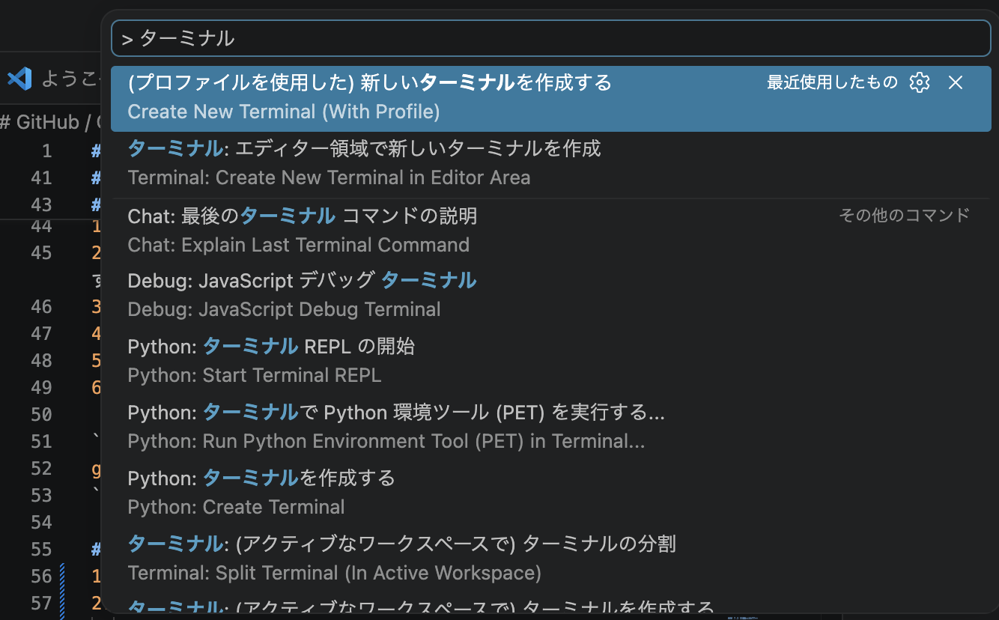
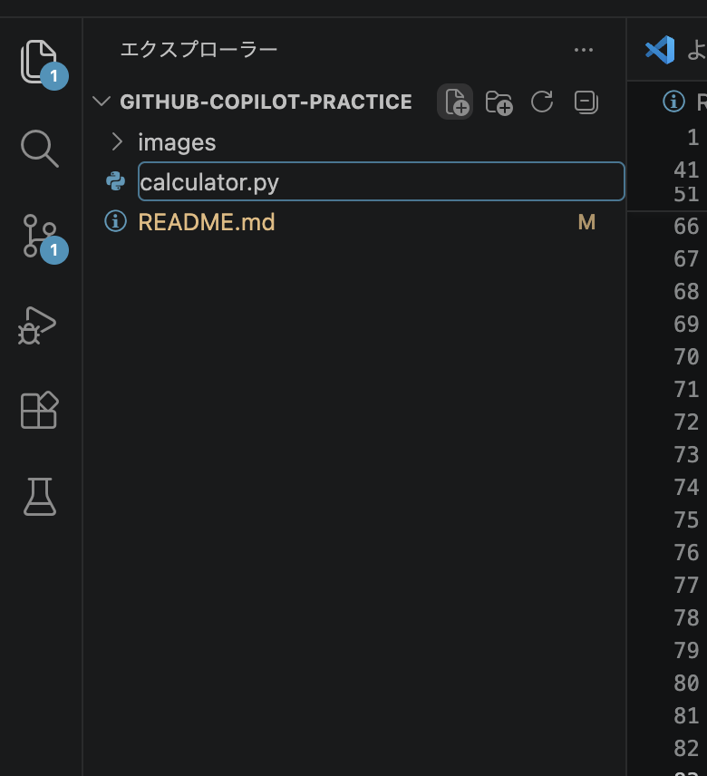

# GitHub / GitHub Copilot の基本操作ハンズオン

## 1. 目的
この README では、Git と GitHub を使ってファイルの変更履歴を管理し、GitHub に反映する基本的な開発フローを学びます。GitHub Copilot を活用しながら、README の作成、コミット、ブランチ、プッシュ、Pull Request、マージまでを体験します。

- Git の基本操作を理解する
- GitHub への反映手順を覚える
- ブランチと Pull Request の流れを把握する
- GitHub Copilot を開発補助に使う方法を知る

## 2. プロジェクト概要
このハンズオンは、GitHub での共同開発を始めるための入門教材です。ローカル環境で変更を管理し、GitHub に送信してレビュー・統合する一連の流れを確認します。

## 3. 前提条件
次のものがあることを前提に進めます。

- Git がインストールされていること
- GitHub アカウントを持っていること
- VS Code などのエディタが使えること
- インターネット接続ができること
- GitHub Copilot を利用できること

## 4. 開発環境
- OS: macOS / Windows / Linux
- Git: 最新版
- エディタ: VS Code
- リモート管理先: GitHub

## 5. ハンズオン全体の流れ
1. GitHub で Repository を作成する
2. GitHub からローカルに Clone する
3. README を作成・編集する
4. 変更を Commit する
5. ブランチを作成する
6. 変更を Push する
7. Pull Request を作成する
8. Merge する
9. Conflict を解消する
10. Release する

## 6. ステップ一覧

### 6.1 Repository 作成
GitHub上にプロジェクトを管理するためのリポジトリ（コードや変更履歴を保存する場所）を作成します。
1. GitHub にログインします。
2. 右上の「+」ボタンをクリックし、「New repository」を選択します。
3. リポジトリ名を入力します。
4. Public / Private を選択します。
5. 「Create repository」をクリックします。
6. 作成されたリポジトリの URL をコピーしておきます。

### 6.2 Remote 設定
ローカル環境のリポジトリとGitHub上のリポジトリ（リモートリポジトリ）を紐づけます。
1. VS Codeを起動します。
2. VS Code上部メニューから  
   **「ターミナル」→「（プロファイルを使用した）新しいターミナルを作成する」**  
   を選択してターミナルを開きます。

3. ローカルリポジトリとGitHubリポジトリを紐づけます。
    以下のコマンドを実行します。
```bash
git remote add origin <GitHub リポジトリ URL>
```
    設定を確認する場合は、以下のコマンドを実行します。
```
git remote -v
```

### 6.3 Clone
GitHub上のリポジトリ（リモートリポジトリ）をローカル環境にコピーし、VS Codeで編集できる状態にします。
1. GitHub のリポジトリページを開きます。
2. 「Code」ボタンをクリックします。
3. HTTPS または SSH の URL をコピーします。

4. VS Codeで開いたターミナルに、以下のコマンドを入力します。
```bash
git clone <repository-url>
cd <repository-name>
```
5. Cloneが完了すると、リポジトリのフォルダーへ移動できます。

### 6.4 Test File 作成
Gitの操作確認用として、簡単な計算を行うテストファイルを作成します。
1. VS Codeでリポジトリフォルダーを開きます。
2. 計算用のファイルを作成します。  
   左側のエクスプローラーで **「新しいファイル」** を選択し、`calculator.py` と入力してファイルを作成します。


### 6.5 Commit
1. 変更したファイルをステージングエリアに追加します。
2. コミットメッセージを付けて保存します。
```bash
git add README.md
git commit -m "README を追加"
```

### 6.5 Branch
1. 作業内容ごとにブランチを作成します。
2. ローカルでも同じブランチを作成します。

```bash
git switch -c feature/readme-update
```

### 6.6 Push
1. 変更内容を GitHub に送信します。
2. 初回は upstream の設定が必要な場合があります。

```bash
git push -u origin feature/readme-update
```

### 6.7 Pull Request
1. GitHub のリポジトリページで「Compare & pull request」を選択します。
2. タイトルと説明を入力します。
3. 「Create pull request」をクリックします。

### 6.8 Merge
1. Pull Request の内容を確認します。
2. 問題がなければ「Merge pull request」をクリックします。
3. ローカルの main も最新状態に更新します。

```bash
git switch main
git pull origin main
```

### 6.9 Conflict 解消
1. 複数人が同じ箇所を変更した場合、競合が発生します。
2. エディタで競合箇所を確認し、必要な内容を残します。
3. 修正後にステージングしてコミットします。

```bash
git add .
git commit -m "Conflict を解消"
```

### 6.10 Release
1. GitHub のリポジトリで「Releases」を開きます。
2. 「Draft a new release」をクリックします。
3. タグ名とリリースノートを入力し、「Publish release」をクリックします。

## 7. Git と GitHub の基本コマンド

### 7.1 状態確認
```bash
git status
```

### 7.2 変更を追加する
```bash
git add <ファイル名>
# すべて追加する場合
git add .
```

### 7.3 コミットする
```bash
git commit -m "メッセージ"
```

### 7.4 履歴を確認する
```bash
git log --oneline --graph --decorate
```

### 7.5 リモートに送信する
```bash
git push origin <branch-name>
```

### 7.6 リモートの変更を取り込む
```bash
git pull origin <branch-name>
```

## 8. GitHub Copilot の使いどころ
- README やドキュメントの文章補完
- コードや設定ファイルのひな型作成
- 関数実装の提案
- コミットメッセージや Pull Request の説明文作成

## 9. 学習後にできるようになること
このハンズオンを終えると、次のことができるようになります。

- Git で変更履歴を管理できる
- ブランチを使って作業を分けられる
- GitHub に変更を反映できる
- Pull Request を通じてレビューを受けられる
- 競合を解消できる
- リリース管理の基本を理解できる

## 10. ライセンス
このプロジェクトは MIT License のもとで公開します。
