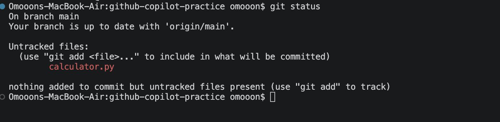
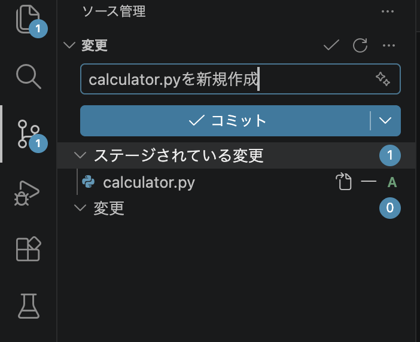

# GitHub / GitHub Copilot の基本操作ハンズオン

## 1. 目的
この README では、Git と GitHub を使ってファイルの変更履歴を管理し、GitHub に反映する基本的な開発フローを学びます。GitHub Copilot を活用しながら、README の作成、コミット、ブランチ、プッシュ、Pull Request、マージまでを体験します。

- Git の基本操作を理解する
- GitHub への反映手順を覚える
- ブランチと Pull Request の流れを把握する
- GitHub Copilot を開発補助に使う方法を知る

## 2. プロジェクト概要
このハンズオンは、GitHub での共同開発を始めるための入門教材です。ローカル環境で変更を管理し、GitHub に送信してレビュー・統合する一連の流れを確認します。

## 3. 前提条件
次のものがあることを前提に進めます。

- Git がインストールされていること
- GitHub アカウントを持っていること
- VS Code などのエディタが使えること
- インターネット接続ができること
- GitHub Copilot を利用できること

## 4. 開発環境
- OS: macOS / Windows / Linux
- Git: 最新版
- エディタ: VS Code
- リモート管理先: GitHub

## 5. ハンズオン全体の流れ
1. 
2. 
3. 

## 6. ステップ一覧

### 6.1 Repository 作成
GitHub上にプロジェクトを管理するためのリポジトリ（コードや変更履歴を保存する場所）を作成します。
1. GitHub にログインします。
2. 右上の「+」ボタンをクリックし、「New repository」を選択します。
3. リポジトリ名を入力します。
4. Public / Private を選択します。
5. 「Create repository」をクリックします。
6. 作成されたリポジトリの URL をコピーしておきます。

### 6.2 Remote 設定
ローカル環境のリポジトリとGitHub上のリポジトリ（リモートリポジトリ）を紐づけます。
1. VS Codeを起動します。
2. VS Code上部メニューから  
   **「ターミナル」→「（プロファイルを使用した）新しいターミナルを作成する」**  
   を選択してターミナルを開きます。

3. ローカルリポジトリとGitHubリポジトリを紐づけます。
    以下のコマンドを実行します。
```bash
git remote add origin <GitHub リポジトリ URL>
```
    設定を確認する場合は、以下のコマンドを実行します。
```
git remote -v
```

### 6.3 Clone
GitHub上のリポジトリ（リモートリポジトリ）をローカル環境にコピーし、VS Codeで編集できる状態にします。
1. GitHub のリポジトリページを開きます。
2. 「Code」ボタンをクリックします。
3. HTTPS または SSH の URL をコピーします。

4. VS Codeで開いたターミナルに、以下のコマンドを入力します。
```bash
git clone <repository-url>
cd <repository-name>
```
5. Cloneが完了すると、リポジトリのフォルダーへ移動できます。

### 6.4 Test File 作成
Gitの操作確認用として、簡単な計算を行うテストファイルを作成します。
1. VS Codeでリポジトリフォルダーを開きます。
2. 計算用のファイルを作成します。  
   左側のエクスプローラーで **「新しいファイル」** を選択し、`calculator.py` と入力してファイルを作成します。

    正しく作成されると、VS Code左側の **「ソース管理」** （虫眼鏡マークの下のアイコン）に変更を示すマーク（変更ファイルの表示）が表示されます。  
    これは、作成したファイルがローカルリポジトリで認識され、Gitによる管理対象として変更が検出されている状態です。
3. （補足）試しにターミナルで以下のコマンドを実行すると、変更されたファイルを確認できます。
```bash
git status
```


### 6.5 Commit
1. 作成した `calculator.py` をステージングエリアに追加します。
2. 「ソース管理」を押します。
    メッセージ欄にコミットメッセージを追記します（星マークを押すと、ある程度自動で入力してくれます）。
3. 「変更」の下に表示されている calculator.py の「＋」ボタンを押します。
    これにより、ファイルがステージングされ、「ステージされている変更」へ移動します。
    ステージングすることで、コミット対象の変更として登録されます。
4. 「コミット」ボタンを押して、変更を保存します。

5. 変更の同期を押下します。
    これによって、ローカルリポジトリのコミット内容がリモートリポジトリへ反映され、最新の状態に同期されます。
    実際、ローカルレポジトリである自分のpcのファイルとGitHub上のファイルの中身が同じ内容であることが確認できる。

### 6.6 Branch 作成
複数人での開発や機能ごとの作業を行う場合、`main` ブランチとは別に作業用ブランチを作成します。
ブランチを分けることで、既存のコードに影響を与えずに変更を進めることができます。
1. VS Code左下のブランチ名（現在のブランチ）をクリックします。
2. 「新しいブランチを作成」を選択します。
3. 作成するブランチ名を入力します。
   例：
   ```
   sub
   ```
4. 作成したブランチへ切り替わります。ソースを管理の部分で、ブランチを発行を押下します。
   以降の変更は `sub` ブランチ上で行われます。
5. `sub` ブランチ上で `calculator.py` などのファイルを編集します。
6. 変更内容を確認し、コミットします。
   「ソース管理」から変更ファイルをステージングし、コミットメッセージを入力してコミットを実行します。
7. 変更の同期を押下します。
   これによって、ローカルの `sub` ブランチの変更内容がGitHub上のリモートブランチへ反映されます。

### 6.7 mainブランチとsubブランチで別々に作業
ブランチを分けることで、それぞれ独立した状態で開発を進めることができます。
1. `main` ブランチへ切り替えます。
2. `main` ブランチ側でもファイルを編集し、変更をコミットします。
3. `sub` ブランチへ戻り、別の変更を行います。
4. それぞれのブランチで変更を進めることで、以下のように異なる作業履歴を保持できます。
```
main
 └─ A ─ B

sub
 └─ A ─ C
```
    `main` と `sub` は同じコミットから分岐していますが、その後の変更履歴は別々に管理されます。

### 6.8 Merge
`sub` ブランチで作成した変更を `main` ブランチへ取り込みます。
1. `main` ブランチへ切り替えます。
2. 「ソース管理」から「ブランチのマージ」を選択します。
3. Mergeする対象として `sub` ブランチを選択します。
4. Mergeを実行します。
   これによって、`sub` ブランチで行った変更内容が `main` ブランチへ統合されます。
5. Merge後、変更内容を確認します。
6. 問題がなければコミットし、変更の同期を押下します。
   これによって、統合された最新の `main` ブランチの状態がGitHub上へ反映されます。
Merge後の状態は以下のようになります。
```
main
 └─ A ─ B ─ D
          ↑
sub
 └─ A ─ C ─┘
```
    このように、作業用ブランチで進めた変更を `main` ブランチへ取り込むことで、安全に開発内容を統合できます。